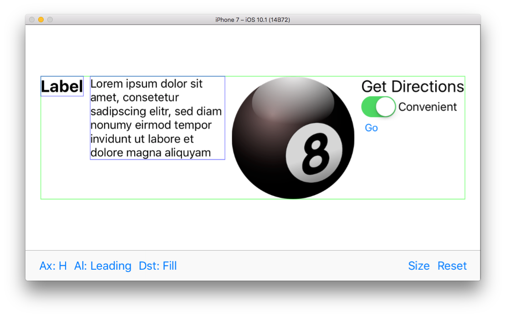

### UIStackView Playground ###

Simple example to experiment with different [UIStackView](https://developer.apple.com/reference/uikit/uistackview) configurations.


##Usage##
Use the toolbar to change the following stack view attributes:

1. Axis ("Ax:")
2. Alignment ("Al.")
3. Distribution ("Dst")
4. Toggle between the stack view being size-constrained (full screen) or adapt to the intrinsic sizes of its child views ("Size")
5. Un-hide all child views ("Reset")

Additional configurations:

1. Long press a view to hide it (and effectively exclude it from the stack view)
2. Tap a view to cycle through its outline settings: (bounds - vertical center, horizontal center)
3. Double tap a view to hide its outline